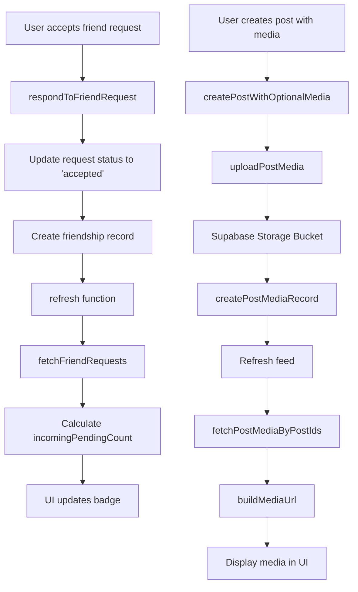

# Design Document: Fix Friend Notifications and Post Media

## Overview

This design addresses two bugs in the Circle application:
1. Friend request notification badge not clearing after acceptance
2. Post media not persisting across page refreshes

The root causes are:
- The notification count filter is correctly checking for `status='pending'`, but the issue is likely in how the UI updates after accepting a request
- Post media storage code is correct, but the Supabase storage bucket 'post-media' may not be configured

## Architecture

### Component Interaction



## Components and Interfaces

### Friend Request Notification Fix

The current code in `use-connections.ts` already correctly filters for pending requests:

```typescript
const incomingPendingCount = useMemo(
  () =>
    requests.filter(
      (request) =>
        request.status === 'pending' && request.direction === 'incoming',
    ).length,
  [requests],
)
```

The issue is that after accepting a request, the `refresh()` function is called, but there might be a race condition or the requests state isn't updating properly.

**Solution**: Ensure the refresh happens after the database transaction completes and verify the status update is working correctly.

### Post Media Storage Fix

The post media code in `post-service.ts` is well-structured:
1. Uploads file to storage bucket
2. Creates post_media record
3. Fetches media with signed URLs

**Potential Issues**:
- Storage bucket 'post-media' doesn't exist
- Storage bucket RLS policies not configured
- Storage bucket is private but policies don't allow access

**Solution**: Create a migration to set up the storage bucket and configure RLS policies.

## Data Models

### Existing Models (No Changes Needed)

```typescript
// Friend Request Record
{
  id: string
  sender_id: string
  receiver_id: string
  status: 'pending' | 'accepted' | 'rejected' | 'cancelled'
  created_at: string
  updated_at: string
}

// Post Media Record
{
  id: string
  post_id: string
  storage_path: string
  media_type: 'image' | 'video'
  width?: number
  height?: number
  duration_seconds?: number
  created_at: string
}
```

## Correctness Properties

*A property is a characteristic or behavior that should hold true across all valid executions of a system—essentially, a formal statement about what the system should do. Properties serve as the bridge between human-readable specifications and machine-verifiable correctness guarantees.*

### Property 1: Pending count only includes pending incoming requests

*For any* set of friend requests for a user, the incoming pending count should equal the number of requests where status='pending' AND direction='incoming'.

**Validates: Requirements 1.2, 1.3**

### Property 2: Friend request acceptance updates status

*For any* friend request with status='pending', after calling the accept operation, the request status should be 'accepted' in the database.

**Validates: Requirements 1.1**

### Property 3: Post media round-trip persistence

*For any* post created with media, after the full creation flow (upload → record creation → fetch), the fetched post should contain media with a valid accessible URL.

**Validates: Requirements 2.1, 2.2, 2.3, 2.4**

## Error Handling

### Storage Bucket Missing

When the storage bucket doesn't exist, the upload will fail with a specific error. The code should:
1. Catch the storage error
2. Display a user-friendly message
3. Log the error for debugging

### Friend Request Race Conditions

If multiple users accept/reject requests simultaneously:
1. Use database constraints to prevent duplicate friendships
2. Handle unique constraint violations gracefully
3. Refresh state after any friend request operation

## Testing Strategy

### Unit Tests

- Test `incomingPendingCount` calculation with various request states
- Test friend request status transitions
- Test media URL generation from storage paths
- Test error handling when storage bucket is missing

### Property-Based Tests

- Generate random sets of friend requests and verify count calculation
- Generate random post media records and verify persistence
- Test status transitions with random initial states

### Integration Tests

- Test full friend request acceptance flow
- Test full post creation with media flow
- Test page refresh with existing posts

### Manual Testing Checklist

1. Accept a friend request and verify badge updates immediately
2. Create a post with an image and refresh the page
3. Switch accounts and verify posts with media are still visible
4. Test with storage bucket not configured (should show helpful error)
