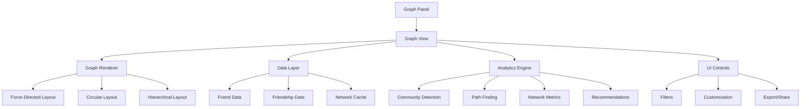
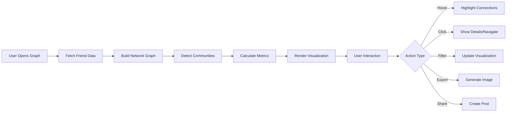

# Design Document: Friend Graph Visualization

## Overview

This design implements a comprehensive friend graph visualization system that displays the user's social network as an interactive, customizable graph. The system includes advanced features like community detection, path finding, network analytics, and sharing capabilities.

## Architecture

### High-Level System Architecture



### Data Flow



## Components and Interfaces

### GraphPanel Component

Navigation element for accessing the graph view.

```typescript
type GraphPanelProps = {
  active: boolean
  onClick: () => void
  disabled?: boolean
}
```

### GraphView Component

Main component for displaying the friend network graph.

```typescript
type GraphViewProps = {
  userId: string
  onBack: () => void
}

type GraphViewState = {
  nodes: GraphNode[]
  edges: GraphEdge[]
  communities: Community[]
  metrics: NetworkMetrics
  selectedNode: GraphNode | null
  highlightedNodes: Set<string>
  layout: 'force-directed' | 'circular' | 'hierarchical'
  showSecondaryFriends: boolean
  colorBy: 'community' | 'friendCount' | 'mutualConnections'
  sizeBy: 'friendCount' | 'clustering' | 'uniform'
  busy: boolean
  error: string | null
}
```

### Data Models

```typescript
type GraphNode = {
  id: string
  label: string
  displayName: string
  username: string
  avatarUrl?: string
  friendCount: number
  mutualConnections: number
  communityId: number
  x?: number
  y?: number
  isRoot: boolean
  isDirectFriend: boolean
}

type GraphEdge = {
  source: string
  target: string
  weight: number // number of mutual connections
  isDirectConnection: boolean
}

type Community = {
  id: number
  members: string[]
  size: number
  density: number
  color: string
}

type NetworkMetrics = {
  totalFriends: number
  totalSecondaryFriends: number
  networkDensity: number
  averageDegree: number
  clusteringCoefficient: number
  networkDiameter: number
  interconnectednessScore: number
  communityCount: number
}

type PathFindingResult = {
  path: string[]
  length: number
  users: GraphNode[]
}

type FriendRecommendation = {
  userId: string
  displayName: string
  username: string
  mutualConnections: number
  reason: string
  score: number
}
```

### useGraphData Hook

Hook for fetching and managing graph data.

```typescript
type UseGraphDataArgs = {
  userId: string | null
  enabled: boolean
}

type UseGraphDataResult = {
  nodes: GraphNode[]
  edges: GraphEdge[]
  communities: Community[]
  metrics: NetworkMetrics
  recommendations: FriendRecommendation[]
  busy: boolean
  error: string | null
  refresh: () => Promise<void>
  findPath: (sourceId: string, targetId: string) => PathFindingResult | null
  getMutualConnections: (userId: string) => string[]
}
```

## Algorithms and Techniques

### Community Detection

Use the Louvain algorithm for community detection:
- Partition the network into communities
- Maximize modularity
- Assign colors to each community
- Calculate community density

### Path Finding

Use Breadth-First Search (BFS) for finding shortest paths:
- Start from source node
- Explore neighbors level by level
- Track parent nodes for path reconstruction
- Return shortest path and length

### Network Metrics Calculation

```typescript
// Network Density = actual connections / possible connections
networkDensity = (2 * edges.length) / (nodes.length * (nodes.length - 1))

// Average Degree = average number of connections per node
averageDegree = (2 * edges.length) / nodes.length

// Clustering Coefficient = measure of how many friends are also friends
clusteringCoefficient = calculateClusteringCoefficient(graph)

// Network Diameter = longest shortest path
networkDiameter = calculateNetworkDiameter(graph)
```

### Layout Algorithms

1. **Force-Directed Layout** (Default)
   - Nodes repel each other
   - Edges act as springs
   - Converges to stable layout
   - Good for general visualization

2. **Circular Layout**
   - Root node at center
   - Direct friends in inner circle
   - Secondary friends in outer circle
   - Good for hierarchical view

3. **Hierarchical Layout**
   - Root at top
   - Friends below
   - Secondary friends at bottom
   - Good for tree-like structures

## Correctness Properties

*A property is a characteristic or behavior that should hold true across all valid executions of a system—essentially, a formal statement about what the system should do.*

### Property 1: Graph completeness

*For any* user with friends, the graph should display all direct friends and their connections to secondary friends, with no missing nodes or edges.

**Validates: Requirements 2.1, 2.2, 2.3, 2.4, 2.5**

### Property 2: Community detection consistency

*For any* network, the community detection algorithm should partition all nodes into communities such that nodes within communities are more densely connected than nodes between communities.

**Validates: Requirements 10.1, 10.2, 10.3, 10.4**

### Property 3: Path finding correctness

*For any* two connected nodes in the graph, the path finding algorithm should return the shortest path between them, with no shorter path existing.

**Validates: Requirements 12.2, 12.3, 12.4**

### Property 4: Metrics accuracy

*For any* network, the calculated metrics (density, degree, clustering coefficient, diameter) should accurately reflect the network structure.

**Validates: Requirements 13.2, 13.3, 13.4, 13.5**

### Property 5: Mutual connections accuracy

*For any* pair of direct friends, the system should correctly identify and count all mutual connections between them.

**Validates: Requirements 9.1, 9.2, 9.3, 9.5**

### Property 6: Recommendation quality

*For any* user, the recommended friends should have the highest number of mutual connections and should bridge network gaps.

**Validates: Requirements 14.2, 14.3, 14.4**

### Property 7: Graph data consistency

*For any* graph view, the displayed data should match the current state in the database, with no stale or inconsistent information.

**Validates: Requirements 7.1, 7.2, 7.3, 7.4**

### Property 8: Privacy enforcement

*For any* shared graph, the privacy settings should be enforced, with restricted information hidden from unauthorized viewers.

**Validates: Requirements 15.2, 15.3, 15.4**

## Error Handling

### Data Fetch Errors
- Retry with exponential backoff
- Display user-friendly error messages
- Provide manual refresh option

### Large Network Handling
- Implement pagination for very large networks
- Use lazy loading for secondary friends
- Show loading indicators during processing

### Rendering Errors
- Fallback to simpler layout if complex layout fails
- Display error message with retry option
- Log errors for debugging

### Performance Issues
- Monitor rendering time
- Implement WebWorkers for heavy computations
- Cache computed results

## Testing Strategy

### Unit Tests
- Test community detection algorithm
- Test path finding algorithm
- Test metrics calculations
- Test mutual connections counting
- Test recommendation scoring

### Property-Based Tests
- Generate random networks and verify graph completeness
- Generate random networks and verify metrics accuracy
- Test path finding with various network topologies
- Test community detection with different network structures

### Integration Tests
- Test full graph loading and rendering
- Test user interactions (hover, click, filter)
- Test export and sharing functionality
- Test privacy enforcement

### Performance Tests
- Test rendering with 50, 100, 500 nodes
- Measure interaction response time
- Test memory usage with large networks
- Benchmark layout algorithms

### Manual Testing Checklist
1. Load graph with various network sizes
2. Hover over nodes and verify highlighting
3. Click nodes and verify navigation
4. Test all layout algorithms
5. Test filtering (show/hide secondary friends)
6. Test zoom and pan controls
7. Test export as image
8. Test sharing as post
9. Test path finding between nodes
10. Verify metrics accuracy
11. Test community detection coloring
12. Test recommendations
13. Test privacy settings
14. Test timeline animation
