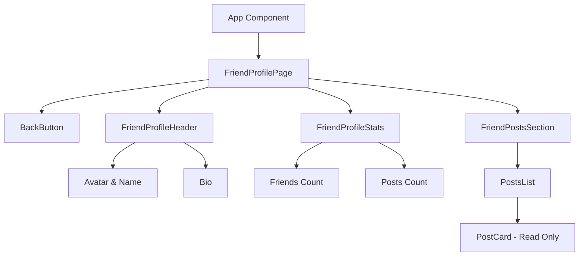
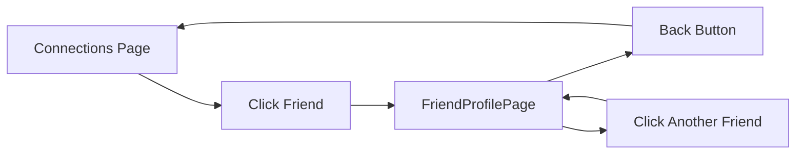

# Design Document: Friend Profile View

## Overview

This design implements a friend profile view feature that displays a friend's profile information, posts, and statistics in a read-only format. The view mirrors the user's own profile but prevents editing and post deletion operations.

## Architecture

### Component Structure



### Navigation Flow



### Data Flow

```typescript
// Friend ID passed via route or state
FriendProfilePage receives friendId
  ↓
useFriendProfile hook fetches:
  - Friend profile data
  - Friend's posts
  - Friend's friend count
  - Friend's post count
  ↓
Components render read-only data
  ↓
User can navigate back or to other friends
```

## Components and Interfaces

### FriendProfilePage Component

The main component for displaying a friend's profile.

```typescript
type FriendProfilePageProps = {
  friendId: string
  onBack: () => void
}

type FriendProfilePageState = {
  profile: ProfileRecord | null
  posts: FeedPost[]
  friendCount: number
  postCount: number
  busy: boolean
  message: string | null
  error: string | null
}
```

### useFriendProfile Hook

Hook for fetching friend profile data.

```typescript
type UseFriendProfileArgs = {
  friendId: string | null
  enabled: boolean
}

type UseFriendProfileResult = {
  profile: ProfileRecord | null
  posts: FeedPost[]
  friendCount: number
  postCount: number
  busy: boolean
  message: string | null
  error: string | null
  refresh: () => Promise<void>
}
```

### FriendProfileHeader Component

Displays friend's basic profile information.

```typescript
type FriendProfileHeaderProps = {
  profile: ProfileRecord | null
  onBack: () => void
}
```

### FriendProfileStats Component

Displays friend's statistics.

```typescript
type FriendProfileStatsProps = {
  friendCount: number
  postCount: number
}
```

### FriendPostsSection Component

Displays friend's posts in read-only format.

```typescript
type FriendPostsSectionProps = {
  posts: FeedPost[]
  busy: boolean
}
```

## Data Models

### Profile Record (Existing)

```typescript
type ProfileRecord = {
  id: string
  username: string
  display_name: string
  bio: string
  avatar_url?: string
  created_at: string
  updated_at: string
}
```

### Feed Post (Existing)

```typescript
type FeedPost = {
  id: string
  author: string
  handle: string
  time: string
  text: string
  likes: number
  comments: number
  media?: FeedPostMedia | null
}
```

## Correctness Properties

*A property is a characteristic or behavior that should hold true across all valid executions of a system—essentially, a formal statement about what the system should do. Properties serve as the bridge between human-readable specifications and machine-verifiable correctness guarantees.*

### Property 1: Friend profile data accuracy

*For any* friend, when loading their profile, the displayed profile data should match the current data in the database for that friend.

**Validates: Requirements 7.1, 7.2, 7.3**

### Property 2: Friend posts display consistency

*For any* friend, the posts displayed should exactly match all posts created by that friend, ordered by creation date descending, and should not include delete buttons.

**Validates: Requirements 3.1, 3.3, 3.4, 3.5**

### Property 3: Friend profile is read-only

*For any* friend profile view, no edit controls, save buttons, or delete buttons should be visible or functional.

**Validates: Requirements 5.1, 5.2, 5.3, 5.4**

### Property 4: Friend statistics accuracy

*For any* friend, the displayed friend count and post count should match the actual counts in the database.

**Validates: Requirements 4.1, 4.2, 4.3, 4.4**

### Property 5: Navigation state consistency

*For any* friend profile navigation, the back button should return to the previous view, and navigating to a different friend should load that friend's data correctly.

**Validates: Requirements 6.1, 6.2, 6.3, 6.4**

## Error Handling

### Friend Not Found

- If friend ID is invalid, display error message
- Provide option to return to connections
- Log error for debugging

### Friend No Longer Connected

- If user is no longer friends with the person, display message
- Offer to return to connections
- Prevent viewing profile

### Data Fetch Errors

- If profile fetch fails, show error message with retry
- If posts fetch fails, show error message with retry
- If statistics fetch fails, show placeholder values

### Navigation Errors

- If back button fails, provide alternative navigation
- Handle missing friend ID gracefully
- Prevent navigation to invalid friend IDs

## Testing Strategy

### Unit Tests

- Test friend profile data display
- Test read-only state (no edit/delete buttons)
- Test statistics display
- Test empty posts state
- Test error message display
- Test back button functionality

### Property-Based Tests

- Generate random friend profiles and verify display accuracy
- Generate random posts and verify ordering
- Test navigation with various friend IDs
- Test data refresh with changing friend data

### Integration Tests

- Test full friend profile load flow
- Test navigation from connections to friend profile
- Test back button navigation
- Test switching between different friend profiles
- Test friend profile with various post counts

### Manual Testing Checklist

1. Click on a friend in connections - should load their profile
2. Verify friend's name, username, and bio display correctly
3. Verify friend's posts are displayed
4. Verify no edit button is visible
5. Verify no delete buttons on posts
6. Verify friend count and post count display
7. Click back button - should return to connections
8. Click on another friend - should load their profile
9. Refresh page - data should remain consistent
10. Test with friend who has no posts - should show empty state
