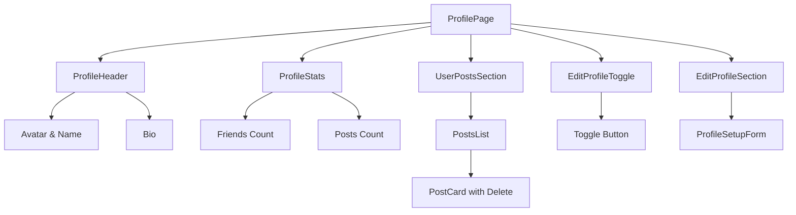
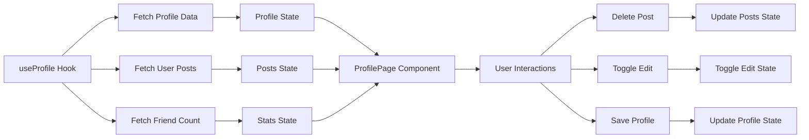

# Design Document: Profile Management

## Overview

This design implements a comprehensive profile management system for Circle. The profile page will feature:
- Collapsible edit section (hidden by default)
- Statistics panel showing friend and post counts
- User's posts section with deletion capability
- Real-time updates when posts or friendships change

## Architecture

### Component Structure



### Data Flow



## Components and Interfaces

### ProfilePage Component

The main profile page component that orchestrates all sub-components.

```typescript
type ProfilePageProps = {
  busy: boolean
  message: string | null
  profile: ProfileRecord | null
  session: boolean
  userEmail: string | null
  friendCount: number
  postCount: number
  userPosts: FeedPost[]
  onSignIn: (email: string, password: string) => Promise<void>
  onSignUp: (email: string, password: string) => Promise<void>
  onSaveProfile: (values: ProfileUpdateValues) => Promise<void>
  onDeletePost: (postId: string) => Promise<void>
}
```

### ProfileStats Component

Displays friend count and post count in a statistics panel.

```typescript
type ProfileStatsProps = {
  friendCount: number
  postCount: number
}
```

### UserPostsSection Component

Displays all posts created by the current user with delete functionality.

```typescript
type UserPostsSectionProps = {
  posts: FeedPost[]
  busy: boolean
  onDeletePost: (postId: string) => Promise<void>
}
```

### EditProfileToggle Component

Manages the visibility state of the edit profile section.

```typescript
type EditProfileToggleProps = {
  isVisible: boolean
  onToggle: () => void
}
```

## Data Models

### Profile Record (Existing)

```typescript
type ProfileRecord = {
  id: string
  username: string
  display_name: string
  bio: string
  avatar_url?: string
  created_at: string
  updated_at: string
}
```

### Feed Post (Existing)

```typescript
type FeedPost = {
  id: string
  author: string
  handle: string
  time: string
  text: string
  likes: number
  comments: number
  media?: FeedPostMedia | null
  isLocalOnly?: boolean
}
```

### New Hook: useProfile

```typescript
type UseProfileArgs = {
  userId: string | null
  enabled: boolean
}

type UseProfileResult = {
  profile: ProfileRecord | null
  friendCount: number
  postCount: number
  userPosts: FeedPost[]
  busy: boolean
  message: string | null
  deletePost: (postId: string) => Promise<void>
  refreshProfile: () => Promise<void>
}
```

## Correctness Properties

*A property is a characteristic or behavior that should hold true across all valid executions of a system—essentially, a formal statement about what the system should do. Properties serve as the bridge between human-readable specifications and machine-verifiable correctness guarantees.*

### Property 1: Edit section toggle state consistency

*For any* profile page state, toggling the edit section visibility should alternate between visible and hidden states, and the toggle button text should reflect the current state.

**Validates: Requirements 1.1, 1.2, 1.3, 1.4, 1.5**

### Property 2: Statistics accuracy after operations

*For any* user profile, after creating a post, the post count should increment by one. After deleting a post, the post count should decrement by one. After accepting a friend request, the friend count should increment by one.

**Validates: Requirements 2.3, 2.4, 2.5, 3.4, 4.3, 5.4, 5.5**

### Property 3: User posts list consistency

*For any* user, the posts displayed in the Posts_Section should exactly match the posts created by that user, ordered by creation date descending, and should update immediately when posts are added or deleted.

**Validates: Requirements 3.1, 3.3, 3.4, 3.5, 4.4**

### Property 4: Post deletion cascade

*For any* post deleted by the user, all associated post_media records should also be deleted, and the post should no longer appear in any queries or UI sections.

**Validates: Requirements 4.4, 4.5**

### Property 5: Profile data refresh accuracy

*For any* profile page load or refresh, the friend count and post count should reflect the current state in the database, not stale cached data.

**Validates: Requirements 5.1, 5.2, 5.3**

## Error Handling

### Post Deletion Errors

- If deletion fails, display error message to user
- Retry mechanism for transient failures
- Rollback UI state if deletion fails

### Data Fetch Errors

- If friend count fetch fails, show placeholder
- If post list fetch fails, show error message with retry button
- If profile fetch fails, show error message

### Concurrent Operations

- Prevent multiple simultaneous delete operations
- Queue operations if user clicks delete multiple times
- Show loading state during deletion

## Testing Strategy

### Unit Tests

- Test toggle state management
- Test statistics calculations
- Test post list filtering and sorting
- Test delete confirmation logic
- Test error message display

### Property-Based Tests

- Generate random posts and verify count accuracy
- Generate random friend requests and verify friend count
- Test toggle state transitions with random clicks
- Test post deletion with various post states

### Integration Tests

- Test full profile page load with all data
- Test post creation and immediate count update
- Test post deletion and list update
- Test friendship creation and count update
- Test page refresh and data consistency

### Manual Testing Checklist

1. Load profile page - edit section should be hidden
2. Click edit button - edit section should appear
3. Click edit button again - edit section should hide
4. Create a post - post count should increment
5. Delete a post - post count should decrement and post should disappear
6. Accept a friend request - friend count should increment
7. Refresh page - all counts should be accurate
8. Switch accounts - profile should update correctly
